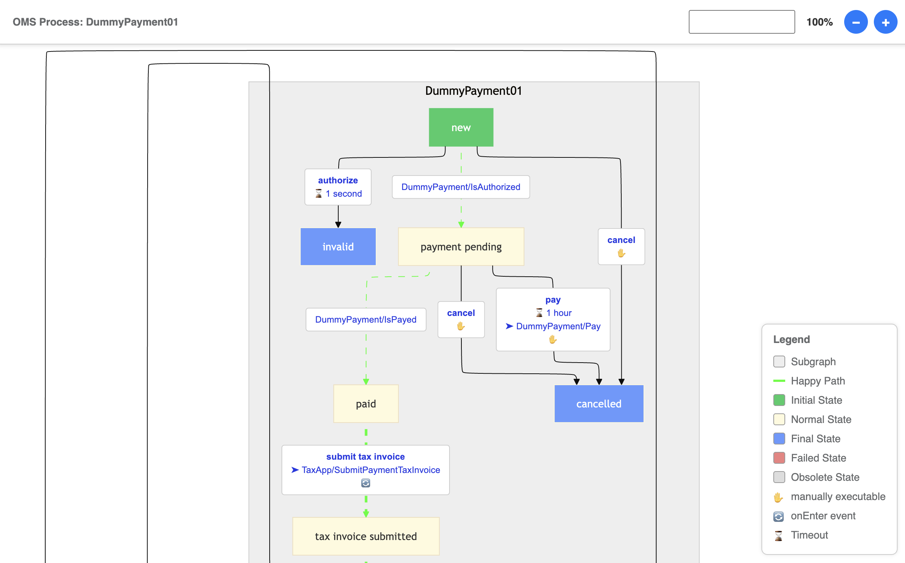

# OMS Visualizer

A modern visualization tool for Spryker OMS (Order Management System) process flows. This package provides an enhanced, user-friendly way to visualize and interact with OMS graphs in your Spryker application.



✓ Tested with Spryker **B2B-Demoshop 202410.0**

## Features

- Modern, interactive visualization of OMS process flows
- Easy integration with existing Spryker projects
- Built on Mermaid JS for reliable and attractive graph rendering
- Background-, Font- and Graph-Colors can be changed via config
- Zoom-In and Zoom-Out
- Highlighting Start-, Final-, Failed- and Dead-States

## Setup

### 1. Install Package

Install the package via Composer:

```bash
composer require spryker-community/oms-visualizer
```


### 2. Integrate ZED Controller

To make the OMS Visualizer accessible through your Spryker application, follow these steps:

1. Add the `SprykerCommunity` namespace to `CORE_NAMESPACES` in your project's `config_default.php` file:

```php
$config[KernelConstants::CORE_NAMESPACES] = [
    'SprykerShop',
    'SprykerEco',
    'Spryker',
    'SprykerCommunity', // Add this line if not exist
];
```

2. Run the following console commands inside the `docker/sdk cli` to update caches:

```bash
console transfer:generate
console cache:empty-all
```

These commands refresh the router cache, generate transfer objects, and warm up the Twig template cache to ensure your changes take effect.

### 3. Install Frontend Assets

The OMS Visualizer uses Mermaid JS for graph visualization. Follow these steps to install the necessary frontend dependencies and assets:

1. Add the `spryker-community` workspace to the root `package.json` of your project:

```
"workspaces": [
   "vendor/spryker/*",
   "vendor/spryker-community/*",
   "vendor/spryker/*/assets/Zed",
   "vendor/spryker-community/*/assets/Zed"
],
```

2. Install all JavaScript dependencies from the `/vendor/spryker-community` directory and compile them for use in your Zed application:

```bash
npm install
```

3. Create a new file at `./frontend/zed/build.js` with the following content:

```javascript
'use strict';

const oryxForZed = require('@spryker/oryx-for-zed');
const path = require('path');
const api = require('@spryker/oryx-for-zed/lib');
const build = require('@spryker/oryx-for-zed/lib/build');
const copyAssetsCallback = require('@spryker/oryx-for-zed/lib/copy');

// Add the OMS Visualizer package to the build process
oryxForZed.settings.entry.dirs.push(path.resolve('./vendor/spryker-community'));

api.getConfiguration(oryxForZed.settings)
    .then((configuration) => build(configuration, copyAssetsCallback))
    .catch((error) => console.error('An error occurred while creating configuration', error));
```

4. Update your project's `package.json` file to include your `./frontend/zed/build.js` as build script:

```
"scripts": {
   "zed": "node ./frontend/zed/build",
   "other-scripts": "your-other-scripts"
}
```

Note: Replace "other-scripts" with your existing script entries.

5. Run the build command to install and compile the frontend assets:

```bash
npm run zed
```

### 4. Add navigation entry

To have a separate navigation menu for the new OMS Visualizer, copy the content from `src/SprykerCommunity/Zed/Communication/navigation.xml` into your `config/Zed/navigation.xml`.

Clear the cache for navigation:

```
vendor/bin/console application:build-navigation-cache
```

## Troubleshooting

### Common Issues

#### Incompatible Version of Chevrotain

If you encounter errors related to the `chevrotain` npm module, you may need to install a compatible version:

```bash
npm install chevrotain@10.4.1
```

This resolves a breaking dependency issue that can occur with newer versions of the package.

## Usage

After installation, you can access the OMS Visualizer through your Zed application's interface. Navigate to the OMS section to view and interact with your process flow visualizations.

## Development

### Running Tests

The OMS Visualizer includes a suite of unit tests to ensure code quality and functionality. To run the tests:

1. Make sure you have installed the development dependencies:

```bash
composer install
```

2. Run the PHPUnit test suite:

```bash
vendor/bin/phpunit
```

The test suite includes:
- Unit tests for the OmsVisualizerFacade
- Tests for the FlowChartRenderer
- Tests for state styling and creation

### Contributing

Contributions are welcome! Please feel free to submit a Pull Request.

## Support

If you encounter any issues or have questions, please open an issue in the GitHub repository.

## License

This package is released under the MIT license.
